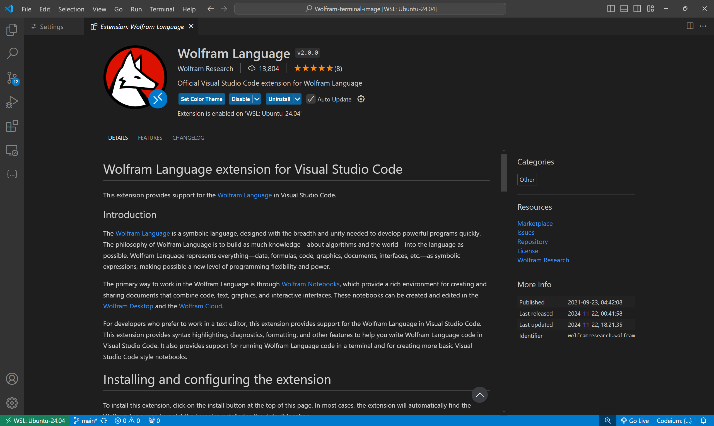

# Wolfram-terminal-image

**Author:** Peng Peng  \
**Email:** [211110103110@stu.just.edu.cn](mailto:211110103110@stu.just.edu.cn)  \
**GitHub:** [TurbulenceChaos](https://github.com/TurbulenceChaos)

---

## Table of Contents

1. [Prerequisites](#1-prerequisites)
2. [Getting Started](#2-getting-started)
   - [For VS Code](#21-for-vs-code)
   - [For Emacs](#22-for-emacs)
     - [Emacs Configuration](#221-emacs-configuration)
     - [Jupyter Wolfram Language Example](#222-executing-jupyter-wolfram-language-code-in-org-mode)
3. [Reference](#3-reference)

---

## 1. Prerequisites
- **`wolframscript`** – Required for executing Wolfram Language scripts.
- **`imgcat`** – Install using `pip install imgcat` to display images in the vscode terminal.
- **`wolframplayer`** (optional) – Needed for playing `.cdf` files.

## 2. Getting Started

### 2.1 For VS Code

1. Enable **`Terminal > Integrated: Enable Images`** and **`Terminal > Integrated: GPU Acceleration`** in VS Code settings.

   

2. Install the official **Wolfram Language extension**.

   

3. Run the `Test.wl` script to verify your setup.

   

### 2.2 For Emacs


#### 2.2.1 Emacs Configuration

```emacs-lisp
;; Load dependencies for Emacs-Jupyter
(add-to-list 'load-path "~/.emacs.d/lisp-site/jupyter/.eldev/30.1/packages/websocket-1.15")
(require 'websocket)

(add-to-list 'load-path "~/.emacs.d/lisp-site/jupyter/.eldev/30.1/packages/simple-httpd-1.5.1")
(require 'simple-httpd)

(add-to-list 'load-path "~/.emacs.d/lisp-site/jupyter/.eldev/30.1/packages/zmq-1.0.2")
(require 'zmq)

(add-to-list 'load-path "~/.emacs.d/lisp-site/jupyter")
(require 'jupyter)

;; Configure Wolfram Mode
(add-to-list 'load-path "~/.emacs.d/lisp-site/xah-wolfram-mode")
(require 'xah-wolfram-mode)
(defalias 'wolfram-language-mode 'xah-wolfram-mode)

;; Configure Org-Babel for Jupyter-Wolfram-Language
(org-babel-do-load-languages
 'org-babel-load-languages
 '((emacs-lisp . t)
   (jupyter . t)))

(setq org-babel-default-header-args:jupyter-Wolfram-Language '((:async . "yes")
                                                               (:kernel . "wolframlanguage14.1")
                                                               (:session . "jupyter-wolfram-language")
                                                               (:results . "value drawer")
                                                               (:comments . "link")
                                                               (:eval . "never-export")))

;; Ensure inline images display correctly
(defun replace-colon-brackets ()
  "Replace ': [[file:' at the beginning of a line with '[[file:' in the current buffer."
  (interactive)
  (save-excursion
    (goto-char (point-min))
    (while (re-search-forward "^: \\\[\\[file:" nil t)
      (replace-match "[[file:" nil nil))))

(add-hook 'org-babel-after-execute-hook
          '(lambda ()
             (replace-colon-brackets)
             (org-display-inline-images)))
```

#### 2.2.2 Executing Jupyter Wolfram Language Code in Org-Mode

First, import the WolframTerminalImage.wl package from [Wolfram-terminal-image](https://github.com/TurbulenceChaos/Wolfram-terminal-image).

```wolfram
#+name: Wolfram-terminal-image
#+begin_src jupyter-Wolfram-Language :results silent
  Get["~/.emacs.d/lisp-site/Wolfram-terminal-image/WolframTerminalImage.wl"]

  (* Specify the terminal type for Wolfram terminal images (options: "vscode", "emacs") *)

  wolframTerminalType = "emacs";

  (* Set the resolution (in DPI) for Wolfram terminal images *)

  wolframTerminalImageResolution = 150;

  (* Enable ("yes") or disable ("no") automatic deletion of Wolfram terminal images *)

  wolframTerminalDeleteImage = "no";

  (* Enable ("yes") or disable ("no") playback of Wolfram terminal CDF files *)

  wolframTerminalPlay = "no";

  (* Specify the player application for Wolfram terminal CDF files *)

  (* Options: "/path/to/wolframplayer" for Linux or WSL2, "/path/to/wolframplayer.exe" for Windows or WSL2 *)

  wolframplayer = "wolframplayer";

  (* To restore `$Post` to its original state, simply execute "$Post=." *)
#+end_src
```

Next, test Jupyter-Wolfram-Language by solving a PDE and visualizing the solution with a plot.

```wolfram
#+name: Wolfram-test
#+begin_src jupyter-Wolfram-Language
  sol1 = DSolve[{D[y[x, t], t] + 2 D[y[x, t], x] == Sin[x], y[0, t] == 
    Cos[t]}, y[x, t], {x, t}]

  sol2 = sol1[[1, 1, 2]]

  Plot3D[sol2, {x, -10, 10}, {t, -5, 5}]
#+end_src
```

For my Emacs configuration, check out: [SCI-emacs](https://github.com/TurbulenceChaos/SCI-emacs).

## 3. Reference

1. [Wolfram Community Discussion](https://community.wolfram.com/groups/-/m/t/2864001)
2. [Mathematica Stack Exchange](https://mathematica.stackexchange.com/questions/258273/how-to-set-up-a-plot-viewer-for-wolfram-engine)
